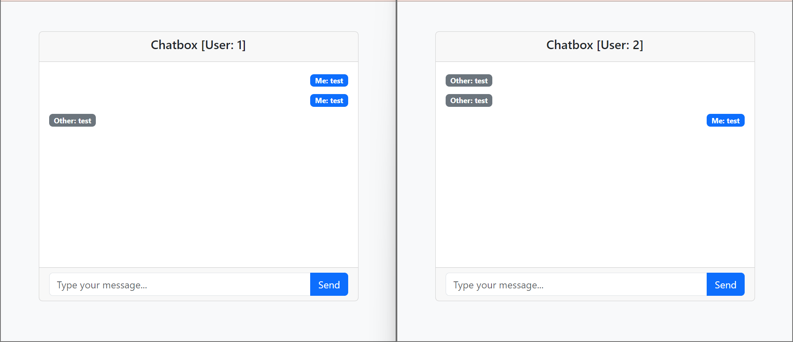

# Chat Application Using RabbitMQ
- This app is a real-time chat with only two users that use the RabbitMQ as its server.
- I use PHP for practicing reasons but this app can be implemented by only the front-end because our backend here the RabbitMQ itself

# Prerequisites
1. Should Have PHP
2. Install Erlang Guide [Here](https://www.rabbitmq.com/docs/which-erlang)
3. Install RabbitMQ Service Installer [Here](https://www.rabbitmq.com/docs/install-windows#downloads)

# Runing the app
1. Install dependencies using composer
    - autoload files map them with namespaces
    - `"php-amqplib/php-amqplib"`
```
composer install
```
2. Run PHP server in the working directory
```
php -S localhost:8080
```

# App UI


# Testing
- Test RabbitMQ
```
C:\Program Files\RabbitMQ Server\rabbitmq_server-4.0.2\sbin>rabbitmqctl.bat status
C:\Program Files\RabbitMQ Server\rabbitmq_server-4.0.2\sbin>ping kareem
```
- Test the application
    - Open two browsers and navigate to `http://localhost:8080/user1.view.php` and `http://localhost:8080/user2.view.php`
    - Open a terminal window and run the `console.view.php` file
    ```
    php console.view.php
    ```
    - Send messages from each user and check if the other user receives the messages
    - Messages should be received by the console as well

## BUG that I faced today 16/10/2024

- I got [2 queues] => `user1`, `user2`
    - `user1.view.php`    ===> consumes the two queues [ and this is my mistake ]
    - `user2.view.php`    ===> consumes the two queues [ and this is my mistake ]
    - `console.view.php`  ===> consumes the two queues [ and this is my mistake ]
- Every file of them should have their queue separate from others
    - `user1.view.php`    ===> consumes `user1` queue [ correct ]
    - `user2.view.php`    ===> consumes `user2` queue [ correct ]
    - `console.view.php`  ===> consumes `console` queue [ another queue ]
- In the `exchange.php` - I made a declaration for both queues and publish the messages to them

## In the previous approach:
- We need to define a queue for each new consumer
- For example - I decide to extend my consumers and make a new consumer called `console`
- To make this consumer, I declared a new queue called console in the `exchange.php` and `console.view.php`
- I made this to make the console [my new consumer] listen from exchanging as well


